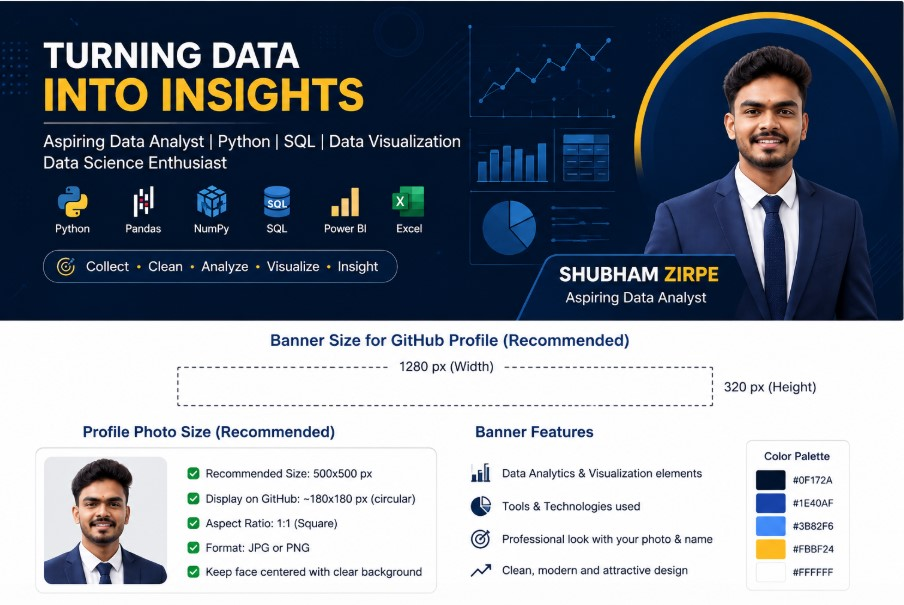

```html
<h1 align="center">Hi 👋, I'm Shubham Zirpe</h1>

<h3 align="center">
Aspiring Data Analyst | Python | SQL | Data Visualization | Data Science Enthusiast
</h3>

<p align="center">
  
</p>

<p align="center">
  
</p>

<p align="center">
  
</p>

---

## 👨‍💻 About Me

I’m an aspiring **Data Analyst** currently pursuing a **Data Analytics & Data Science program at Ethans Tech**.

I’m building strong skills in **Python, Pandas, NumPy, Matplotlib, Seaborn and SQL**, while currently learning **Excel, Power BI, Statistics, Data Visualization and Machine Learning**.

I enjoy working with datasets, solving analytical problems, creating visualizations, and turning data into meaningful insights.

🎯 **Goal:** Start my career as a Data Analyst, gain real-world experience, and grow toward Data Science.

🚀 **Open to:** Data Analyst internships and opportunities to learn, contribute, and grow.

---

## 🎓 Education

**B.Tech in Information Technology**  
**SGGSIE&T, Nanded**  
**Graduation Year: 2026**

---

# 📚 Practice & Learning

I am currently practicing Data Analytics concepts using datasets and hands-on exercises.

### 🐍 Python Practice

- Python fundamentals
- Variables and data types
- Conditional statements
- Loops
- Functions
- Lists, Tuples, Sets and Dictionaries
- String operations
- List comprehension
- Problem solving
- Object-Oriented Programming basics

### 🐼 Pandas Practice

- Series and DataFrames
- Data cleaning
- Handling missing values
- Filtering and sorting
- GroupBy
- Aggregation
- `value_counts()`
- `unique()` and `nunique()`
- `fillna()`
- `dropna()`
- Data type conversion
- Working with CSV datasets
- Exploratory Data Analysis

### 🔢 NumPy Practice

- NumPy arrays
- Array creation
- Indexing and slicing
- Reshaping
- `arange()`
- `zeros()`
- `ones()`
- `eye()`
- Mathematical operations
- Boolean indexing
- Broadcasting
- Array manipulation

### 📊 Matplotlib Practice

- Line plots
- Bar charts
- Horizontal bar charts
- Histograms
- Pie charts
- Scatter plots
- Subplots
- Multiple plots
- Titles and labels
- Legends
- Ticks and rotation
- Figure customization

### 📈 Seaborn Practice

- Bar plots
- Line plots
- Scatter plots
- Histograms
- Box plots
- Count plots
- Heatmaps
- Working with DataFrames
- Data visualization

### 🗄️ SQL Practice

Currently building SQL skills including:

- SELECT
- WHERE
- ORDER BY
- GROUP BY
- HAVING
- DISTINCT
- Aggregate functions
- CASE statements
- JOINs
- Subqueries
- Data filtering
- Data analysis queries

---

# 🚀 Currently Learning

I am continuously expanding my Data Analytics and Data Science skills.

- 🗄️ **SQL**
- 📊 **Microsoft Excel**
- 📈 **Power BI**
- 📐 **Statistics**
- 📊 **Data Visualization**
- 🤖 **Machine Learning**
- 🧠 **Data Science**
- 🐍 **Advanced Python for Data Analysis**

---

# 🛠️ Skills

## Programming

<p align="left">
<a href="https://www.python.org">

</a>
</p>

## Data Analysis

<p align="left">

<a href="https://pandas.pydata.org/">

</a>

<a href="https://numpy.org/">

</a>

<a href="https://www.mysql.com/">

</a>

</p>

## Data Visualization

<p align="left">

<a href="https://matplotlib.org/">

</a>

<a href="https://seaborn.pydata.org/">

</a>

</p>

## Analytics & Business Intelligence

<p align="left">


</p>

## Statistics & Data Science

<p align="left">


</p>

## Tools

<p align="left">

<a href="https://jupyter.org/">

</a>

<a href="https://git-scm.com/">

</a>

<a href="https://github.com/">

</a>

</p>

---

# 📂 Practice Repositories

### 🐍 Python Library Practice

Practice repository where I explore and understand commonly used Python libraries.

🔗 **Repository:**  
https://github.com/zirpeshubham75-ui/Python-Libarary

---

### 🐍 Python Practice

A collection of Python programming practice, concepts and problem-solving exercises.

🔗 **Repository:**  
https://github.com/zirpeshubham75-ui/Python-Practice

---

# 📊 Data Analytics Learning Roadmap

```text
Python
   ↓
NumPy + Pandas
   ↓
Data Cleaning
   ↓
Exploratory Data Analysis
   ↓
Matplotlib + Seaborn
   ↓
SQL
   ↓
Microsoft Excel
   ↓
Power BI
   ↓
Statistics
   ↓
Machine Learning
   ↓
Data Science
````

---

# 🎯 Career Goal

My short-term goal is to start my career as a **Data Analyst**, work with real-world datasets, develop strong analytical skills, and contribute to data-driven decision making.

My long-term goal is to grow toward advanced **Data Science and Machine Learning** roles.

---

# 🤝 Connect With Me

<p align="left">

<a href="https://www.linkedin.com/in/shubham-zirpe-4982a8420/" target="_blank">

</a>

<a href="mailto:zirpeshubham75@gmail.com">

</a>

<a href="https://github.com/zirpeshubham75-ui" target="_blank">

</a>

</p>

📧 **Email:** [zirpeshubham75@gmail.com](mailto:zirpeshubham75@gmail.com)

🔗 **LinkedIn:**
https://www.linkedin.com/in/shubham-zirpe-4982a8420/

💻 **GitHub:**
https://github.com/zirpeshubham75-ui

---

# 📈 GitHub Statistics

<p align="center">


</p>

---

# 🔥 GitHub Streak

<p align="center">


</p>

---

# 🏆 GitHub Trophies

<p align="center">


</p>

---

# 💻 Top Languages

<p align="center">


</p>

---

<h3 align="center">

🚀 Keep Learning • Keep Practicing • Keep Growing

</h3>

<p align="center">

<strong>Turning Data into Insights 📊</strong>

</p>
```
